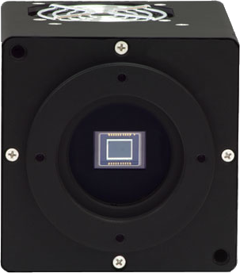

.. _camera-fli:

Finger Lakes Instrumentation Microline camera plugin
----------------------------------------------------



Introduction
````````````
FLI supplies cameras to more than 50 countries for life science imaging, veterinary radiology, astronomy, forensics, transmission electron microscopy, and a wide range of other applications. Our on-site staff includes a talented group of mechanical, electrical, and software engineers.
FLI provides a two Software Development Tool (SDK) for both Windows and Linux.

The Lima module as been tested only with this cameras models:
  - IKon-M and IKon-L (USB interface, Linux OS debian 6)
  - IKon-L (USB interface, Windows XP - 32bits)

Prerequisites
`````````````

Installation & Module configuration
````````````````````````````````````

Follow the generic instructions in :ref:`build_installation`. If using CMake directly, add the following flag:

.. code-block:: sh

  -DLIMACAMERA_FLI=true

For the Tango server installation, refers to :ref:`tango_installation`.

Initialisation and Capabilities
````````````````````````````````

Implementing a new plugin for new detector is driven by the LIMA framework but the developer has some freedoms to choose which standard and specific features will be made available. This section is supposed to give you the correct information regarding how the camera is exported within the LIMA framework.

Camera initialisation
......................

The camera will be initialized within the :cpp:class:`AndorCamera` object. The AndorCamera contructor sets the camera with default parameters for Preampifier-Gain, VerticalShiftSpeed and the ADC/HorizontalSpeed.

These parameters are optimized for the faster mode, which means the maximum gain, the "fasten recommended" VSSpeed (i.e as returned
by GetFastestRecommendedVSSpeed() SDK function call) and the ADC with the faster Horizontal speed.

All the parameters can be set and get using the corresponding methods, the default values (max speeds and gain)
can be applied with -1 as passed value:

 set/getPGain()

 set/getVsSpeed()

 set/getADCSpeed()

Some other methods are available but they can not be supported depending on which camera model you are using:

 set/getHighCapacity()

 set/getFanMode()

 set/getBaselineClamp()

The above parameters, only support enumerate type for values.

Std capabilites
................

This plugin has been implemented in respect of the mandatory capabilites but with some limitations which
are due to the camera and SDK features.  We only provide here extra information for a better understanding
of the capabilities for Andor cameras.

* HwDetInfo

  getCurrImageType/getDefImageType(): the methods call the  SDK GetBitDepth() function to resolve the image
  data type. The bit-depth correspond to the AD channel dynamic range which depends on the selected ADC channel.
  By experience and with IKon detectors we only have Bpp16 of dynamic range, but the methods can return Bpp8 and Bpp32
  as well.

  setCurrImageType(): this method do not change the image type which is fixed to 16bpp.

* HwSync

  get/setTrigMode(): the only supported mode are IntTrig, ExtTrigSingle, ExtGate and IntTrigMult


Optional capabilites
........................
In addition to the standard capabilities, we make the choice to implement some optional capabilities which
are supported by the SDK and the I-Kon cameras. A Shutter control, a hardware ROI and a hardware Binning are available.

* HwShutter

  setMode(): only ShutterAuto and ShutterManual modes are supported

* HwRoi

  There is no restriction for the ROI setting

* HwBin

  There is no restriction for the Binning but the maximum binning is given by the SDK function GetMaximumBinning() which depends
  on the camera model

Configuration
`````````````

 Plug your USB camera on any USB port of the computer, that's it !


How to use
````````````
This is a python code example for a simple test:

.. code-block:: python

  from Lima import FLI
  from lima import Core

  cam = Andor.Camera('/dev/fliusb0')
  hwint = Andor.Interface(cam)
  ct = Core.CtControl(hwint)

  acq = ct.acquisition()

  # setting new file parameters and autosaving mode
  saving=ct.saving()

  pars=saving.getParameters()
  pars.directory='/buffer/lcb18012/opisg/test_lima'
  pars.prefix='test1_'
  pars.suffix='.edf'
  pars.fileFormat=Core.CtSaving.EDF
  pars.savingMode=Core.CtSaving.AutoFrame
  saving.setParameters(pars)

  # set accumulation mode

  acq_pars= acq.getPars()

  #0-normal,1-concatenation,2-accumu
  acq_pars.acqMode = 2
  acq_pars.accMaxExpoTime = 0.05
  acq_pars.acqExpoTime =1
  acq_pars.acqNbFrames = 1

  acq.setPars(acq_pars)
  # here we should have 21 accumalated images per frame
  print acq.getAccNbFrames()

  # now ask for 2 sec. exposure and 10 frames
  acq.setAcqExpoTime(2)
  acq.setNbImages(10)

  ct.prepareAcq()
  ct.startAcq()

  # wait for last image (#9) ready
  lastimg = ct.getStatus().ImageCounters.LastImageReady
  while lastimg !=9:
    time.sleep(1)
    lastimg = ct.getStatus().ImageCounters.LastImageReady

  # read the first image
  im0 = ct.ReadImage(0)
